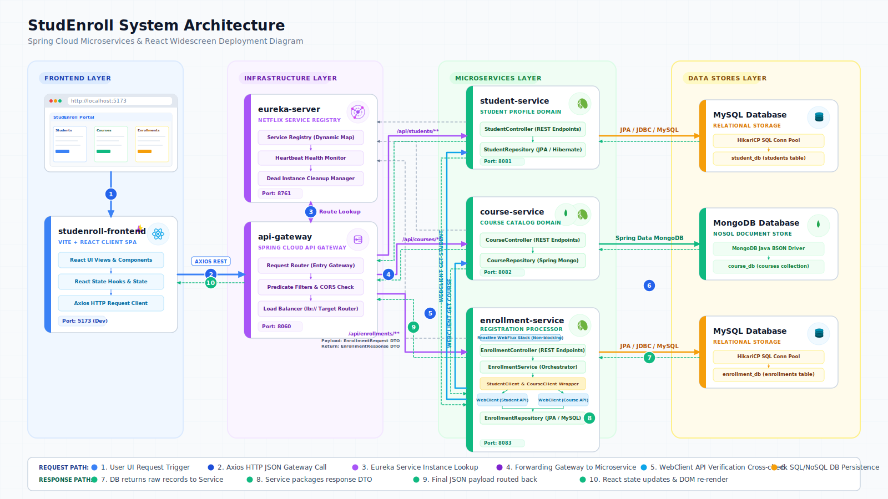

# 🎓 StudEnroll - Student Enrollment Management System

**StudEnroll** is a modern, enterprise-grade, distributed student enrollment system. It is built using a **Spring Cloud microservices architecture** on the backend and a responsive, interactive **React SPA (built with Vite)** on the frontend. The backend services utilize independent database instances (MySQL and MongoDB) and coordinate dynamically using a service discovery registry and an API gateway.

---

## 🏛️ Architecture Overview

The system is fully decoupled and follows a service-oriented architectural pattern:



---

## 📂 Project Structure

The codebase is organized into separate directories for each service and client component:

*   [eureka-server](./eureka-server): Central Netflix Eureka service registry.
*   [api-gateway](./api-gateway): Spring Cloud Gateway for edge-routing, CORS handling, and proxying backend services.
*   [student-service](./student-service): Microservice for managing student profiles and records.
*   [course-service](./course-service): Microservice for managing the course catalog.
*   [enrollment-service](./enrollment-service): Orchestrator service running reactive queries to process course registrations.
*   [studenroll-frontend](./studenroll-frontend): Vite + React single page application dashboard.

---

## 🔌 Service Catalog & Ports

| Service Name | Default Port | Primary Technologies | Data Store | Description |
| :--- | :---: | :--- | :--- | :--- |
| **[eureka-server](./eureka-server)** | `8761` | Spring Cloud Eureka | *None* | Central lookup server for microservice instances. |
| **[api-gateway](./api-gateway)** | `8060` | Spring Cloud Gateway | *None* | Directs routes from frontend, configures CORS settings. |
| **[student-service](./student-service)** | `8081` | Spring Boot, Spring Data JPA | MySQL (`student_db`) | Handles CRUD endpoints for students. |
| **[course-service](./course-service)** | `8082` | Spring Boot, Spring Data MongoDB | MongoDB (`course_db`) | Document-based service managing course files. |
| **[enrollment-service](./enrollment-service)** | `8083` | Spring Boot, WebFlux, JPA | MySQL (`enrollment_db`) | Coordinates enrollment processes and rules. |
| **[studenroll-frontend](./studenroll-frontend)** | `5173` | React 19, Vite, Axios | Browser (Client) | Interactive dashboard interface for student use. |

---

## 🔄 End-to-End System Flow

1.  **Frontend Interaction:** The user accesses the dashboard application running at `http://localhost:5173` and enters their CNIE (national identity card code) to log in.
2.  **API Routing:** Axios requests are sent to the API Gateway at `http://localhost:8060/api/...`.
3.  **Discovery Lookup:** The Gateway contacts the Eureka Server (`http://localhost:8761`) to resolve the target backend service name (e.g. `STUDENT-SERVICE`).
4.  **Reactive Service Orchestration:**
    *   When an enrollment request is triggered, `enrollment-service` verifies the student and course credentials.
    *   It uses a non-blocking Spring **WebClient** (`webClientBuilder`) to call `student-service` and `course-service` concurrently via their service IDs registered on Eureka.
5.  **State Persistence:** Individual domain databases commit the state transactionally.
6.  **CORS Coordination:** The API Gateway manages incoming CORS requests from the frontend, ensuring only pre-configured origins (`http://localhost:5173` and `http://localhost:3000`) are accepted.

---

## 🛠️ Business & Validation Rules

*   **Capacity Limit:** A course cannot have more than **3 enrolled students**. If a student attempts to enroll in a full course, the system throws a `400 Bad Request` with the message: `"Enrollment failed: Course is at maximum capacity (3 students)."`.
*   **Duplicate Enrollments:** A student cannot register for the same course twice. Attempting to do so yields: `"Enrollment failed: Student is already enrolled in this course."`.
*   **Cancellation Limit:** Students can cancel an enrollment, but only **within 24 hours** of the creation timestamp. If the enrollment date is older than 24 hours, the cancel operation throws: `"Enrollment failed: Cannot cancel an enrollment older than 24 hours."`.
*   **Decoupled Entities:** Services coordinate through unique identifiers (`CNIE` for students, MongoDB `id` strings for courses). This isolates databases from hard foreign key dependencies across network boundaries.

---

## 🚀 Setup & Execution Guide

### 1. Prerequisites
Ensure the following databases are running locally:
*   **MySQL Server** (on port `3306`)
*   **MongoDB Server** (on port `27017`)

*Note: Database schemas (`student_db` and `enrollment_db`) will be automatically created on startup by Hibernate DDL Update. MongoDB will create the `course_db` database on the first insert.*

### 2. Configuration Settings
Make sure to check the database usernames and passwords in the configuration files:
*   [student-service application.yml](./student-service/src/main/resources/application.yml)
*   [enrollment-service application.yml](./enrollment-service/src/main/resources/application.yml)

Default credentials in this workspace are:
```yaml
spring:
  datasource:
    username: root
    password: Neof9902
```
*Modify these values to match your local database settings if needed.*

### 3. Backend Startup Order
Run the backend services in the exact sequence outlined below. Open a terminal for each command in the project root:

```bash
# Step A: Start the Service Registry (Eureka)
cd eureka-server && ./mvnw spring-boot:run

# Step B: Start the Domain Microservices
cd student-service && ./mvnw spring-boot:run
cd course-service && ./mvnw spring-boot:run
cd enrollment-service && ./mvnw spring-boot:run

# Step C: Start the API Routing Gateway
# (Ensure Eureka dashboard at http://localhost:8761 shows all 3 services registered)
cd api-gateway && ./mvnw spring-boot:run
```

### 4. Frontend Startup
Open a new terminal at the project root and run:
```bash
cd studenroll-frontend
npm install
npm run dev
```
Open `http://localhost:5173` in your browser.

---

## 📡 API Contract Reference

All client calls must target the API Gateway at `http://localhost:8060/`.

### 👥 Student Service (`/api/students/**`)
*   **`GET /api/students`**: Retrieves a list of all students.
*   **`GET /api/students/{id}`**: Retrieves a single student profile by numeric database ID.
*   **`GET /api/students/cnie/{cnie}`**: Retrieves a student profile by CNIE string (case-insensitive, used for authentication).
*   **`POST /api/students`**: Creates a new student record.
    *   *Payload:*
        ```json
        {
          "cnie": "AB123456",
          "firstName": "John",
          "lastName": "Doe",
          "email": "john.doe@example.com"
        }
        ```

### 📚 Course Service (`/api/courses/**`)
*   **`GET /api/courses`**: Retrieves the list of available courses.
*   **`GET /api/courses/{id}`**: Retrieves a course by its MongoDB String ID.
*   **`POST /api/courses`**: Adds a new course.
    *   *Payload:*
        ```json
        {
          "title": "Introduction to Microservices",
          "description": "Learn Spring Boot, Cloud, and Docker.",
          "credits": 4
        }
        ```

### 📝 Enrollment Service (`/api/enrollments/**`)
*   **`GET /api/enrollments`**: Returns all active enrollments containing mapped course title and student CNIE information.
*   **`POST /api/enrollments`**: Registers a student into a course (validates capacity, existence, and time).
    *   *Payload:*
        ```json
        {
          "studentCnie": "AB123456",
          "courseId": "60d5ec49f563d41f8c8b4567"
        }
        ```
*   **`DELETE /api/enrollments/{id}`**: Deletes/cancels an enrollment record by its DB ID (allowed only within 24 hours of creation).
